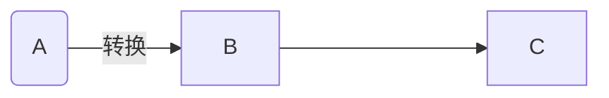

|    标题     | # 标题名字  |           井号的个数代表标题的级数(1~6级)            |
| :---------: | :---------: | :--------------------------------------------------: |
|   删除线    |  ~~文本~~   |          在文本两侧使用 ==成对== 的 ==~~==           |
|    斜体     |   *文本*    |           在文本两侧使用 ==成对== 的 ==*==           |
|    加粗     |  **文本**   |          在文本两侧使用 ==成对== 的 ==**==           |
| 斜体 + 加粗 | ***文本***  |          在文本两侧使用 ==成对== 的 ==***==          |
|   下划线    | <u>文本</u> | 在文本两侧使用 ==<u></u>== 或者 ==快捷键"CTRL + U"== |
|    高亮     |  ==文本==   |         在文本两侧使用 ==成对== 的 ==`==`==          |
|    下标     |  H~2~SO~4~  |           在文本两侧使用 ==成对== 的 ==~==           |
|    上标     | m^2^、m^3^  |           在文本两侧使用 ==成对== 的 ==^==           |

----------

|   插入表格   |    ==快捷键"CTRL + T"==     |                                                              |
| :----------: | :-------------------------: | :----------------------------------------------------------: |
|     引用     |         ==> 文本==          |                       引用可以嵌套使用                       |
|   无序排序   |        ==符号 文本==        | 符号可以是 ==`*`、`-`、`+`==<br />==符号和文本之间要有空格== |
|   有序排序   |       ==数字. 文本==        |                   ==.和文本之间要有空格==                    |
|    代码块    |       ==```语言名称==       |   ==代码块中的文本(包括 Markdown 语法)都会显示为原始内容==   |
|   单行代码   |         =='代码'==          |                                                              |
|    分割线    |                             | ==可以在一行中使用三个或更多的 `*`、`-` 或 `+` 来添加分隔线== |
| 外部链接跳转 |   ==`[提示文字](链接)`==    |               [B站](https://www.bilibili.com/)               |
| md文件内跳转 |   ==`[提示文字](#标题)`==   |                                                              |
|    超链接    |         ==<链接>==          | 使用 `<>` 包括的 ==URL== 或 ==邮箱地址== 会被自动转换为超链接 |
| 加载网络图片 | ==``== |                                                              |


>**链接跳转的使用：CTRL + 点击**

画流程图步骤

```
语言选择mermaid
在方框需要格式时,需要使用别名,如果不用则不需要

graph TB\LR;
	代码...
```

例子：



